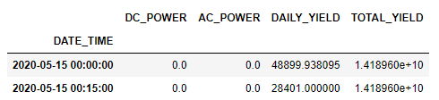
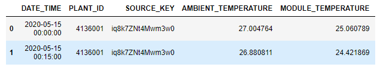

# Solar Power Generation Prediction for Grid Management: Project Overview
* Created a model that predicts the next-day power generation to help power plant with grid management
* Aggregated power generation data from 22 unique inverters
* Downsampled the high-frequency data to appropriate frequency for modeling and prediciton purpose
* Performed differencing to stabilize the non-stationary time series data
* Built a VAR model in order to develop multivariate time series analysis

## Code and Resources Used
**Python Version:** 3.8

**Packages:"" statsmodel, pmdarima, pandas, numpy, matplotlib, seaborn

## Data Overview
2 datasets are used: Power generation data, and weather data
* Power Generation Data: 34 days of power generation data recorded in 15-minute interval

* Weather Data: 34 days of ambient weather data recorded in 15-minute interval

## Data Preprocessing
Extracted date and time columns for both datasets. Other than the timestamp, from the datasets, we have the following features:

Power Generation Data:
* DC Power
* AC Power
* Daily Yield
* Total Yield

Weather Data
* Ambient Temperature
* Module Temperature
* Irradiation

Since our goal is to predict the power generation for the entire power plant, the data from 22 inverters are aggregated. The data size dropped from over 60,000 to 3,000 rows
