# Solar Power Generation Prediction for Grid Management: Project Overview
* Created a model that predicts the next-day power generation to help power plant with grid management
* Aggregated power generation data from 22 unique inverters
* Downsampled the high-frequency data to appropriate frequency for modeling and prediciton purpose
* Performed differencing to stabilize the non-stationary time series data
* Built a VAR model in order to develop multivariate time series analysis

## Code and Resources Used
**Python Version:** 3.8

**Packages:"" statsmodel, pmdarima, pandas, numpy, matplotlib, seaborn

## Data Overview
2 datasets are used: Power generation data, and weather data (After cleaning and feature selection)
* Power Generation Data: 34 days of power generation data recorded in 15-minute interval

* Weather Data: 34 days of ambient weather data recorded in 15-minute interval

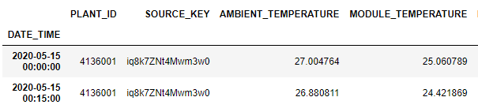
## Data Preprocessing
Extracted date and time columns for both datasets. Other than the timestamp, from the datasets, we have the following features:

Power Generation Data:
* DC Power
* AC Power
* Daily Yield
* Total Yield

Weather Data
* Ambient Temperature
* Module Temperature
* Irradiation

Since our goal is to predict the power generation for the entire power plant, the data from 22 inverters are aggregated. The data size dropped from over 60,000 to 3,000 rows

## EDA
### Distribution
Whole timespan: large amount of zero values in DC_POWER and AC_POWER, which is due to long idle hours (night)

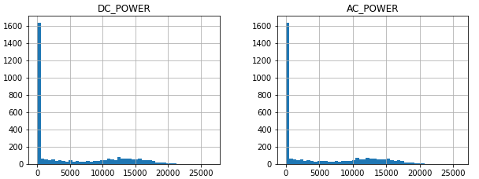

Active hours: dual mode

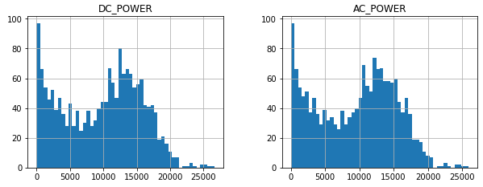

### Correlation
DC_POWER and AC_POWER are perfectly correlated, thus, we only chose DC_POWER as target

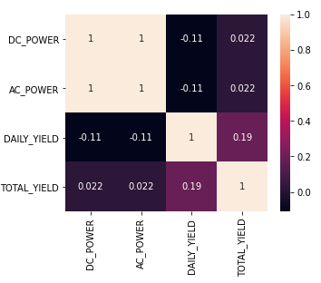

### Relationships among variables
#### Between DC and Daily Yield
We can tell that the power conversion rate is around 20%

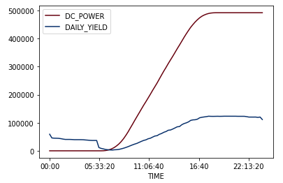

#### Between Ambient and Module Temperature

During the day, module temp is much higher than ambient temp, but both happen simultaneous and highly correlated. Therefore, I only chose Ambient temp as exogenous predictor

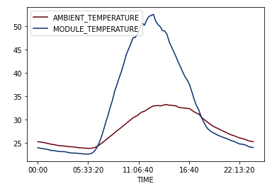

#### Between Ambient Temperature and Irradiation
There is certain delay between irradiation and ambient temp

### Time Series
Mean generation values on an avergae day

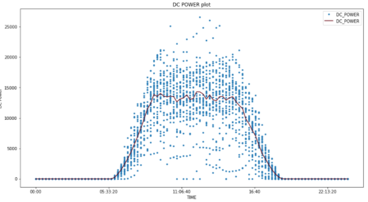

Mean generation values over the whole period

### Target and predictor combined Time Series
Both variables are highly correlated

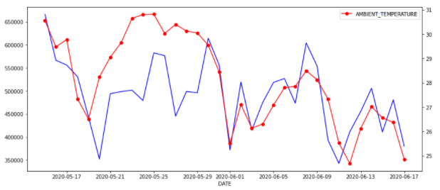

## Model Building
First, I combined the variables from the 2 separate datasets together with selected target and predictor as the same frequency is the same as the original data, 15 minutes

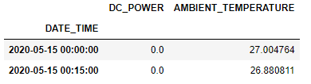

For prediction purpose, I needed to choose a resampling frequency due to the high original frequency. I decided to test 2 different frequencies (8H and 3H), and compare the evaluation metrics at the end in order to pick a suitable one

Then, augmented Dickey-Fuller test was performed, and it turned out that Ambient temperature data is non-stationary. Consequently, after a first order differencing, both variables have become stationary

The last day data were saved as test set

Then, I selected the optimized VAR order according to AIC, built VAR models for the 2 frequencies respectively, chose Root Mean Square Error as evaluation metric, compared the results and selected frequency = 3H as the final frequency
* VAR(4) model for freq=8H, RMSE = 51127

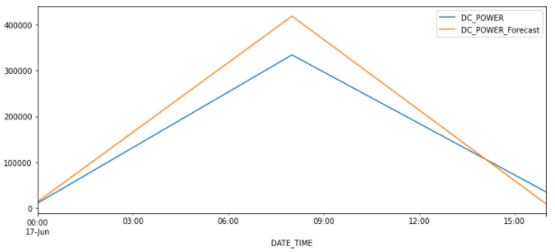

* VAR(7) model for freq=3H, RMSE = 18384

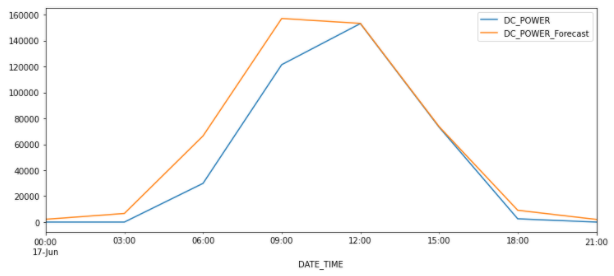

Then, I built a plain AR model with the same order without taking consideration of the exogenous variable, for comparison purpose. VAR model in this case is more accurate than the plain AR.

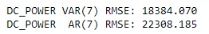

Lastly, the prediction result:

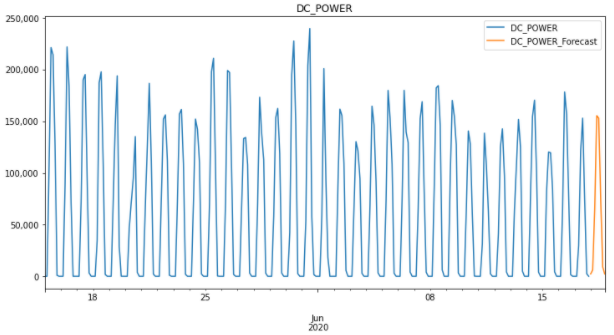
